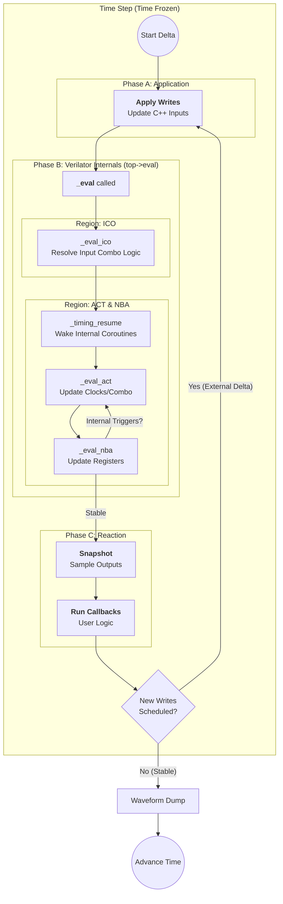
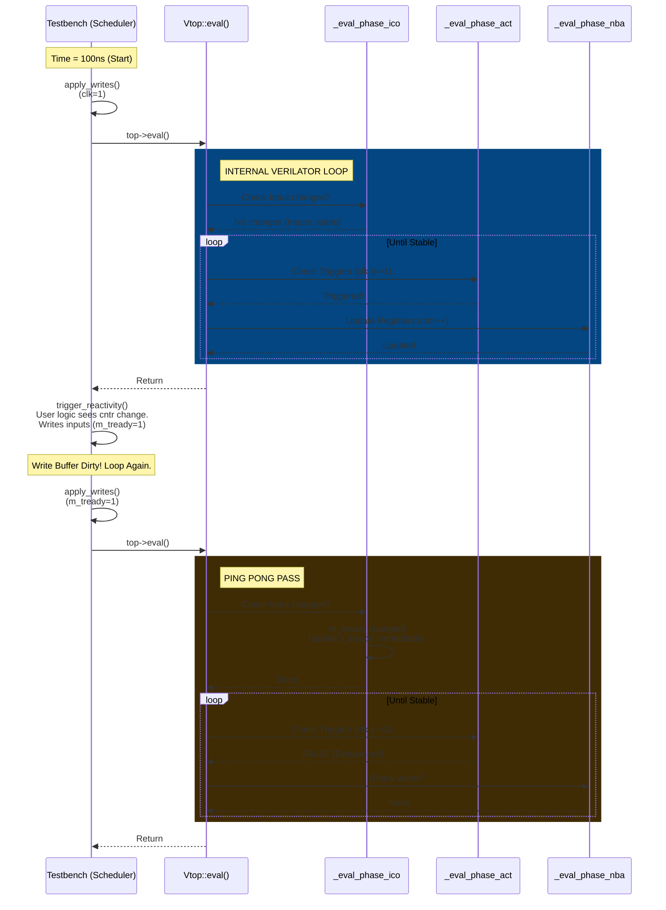
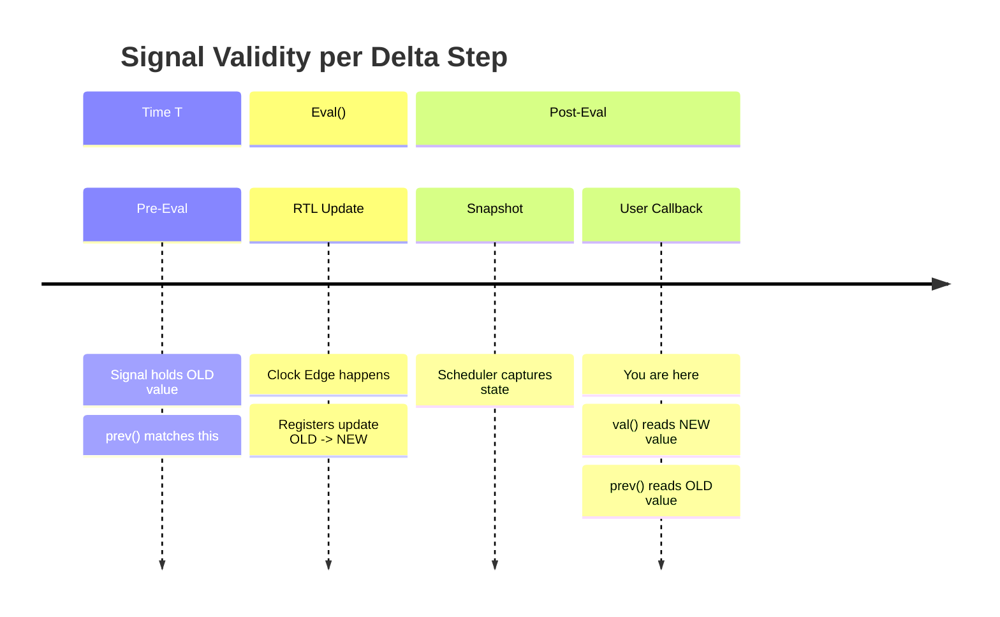

# Scheduler Integration & Execution Semantics

This framework implements an **External Stratified Event Queue** that wraps Verilator's internal Cycle-Based scheduling model. It is designed to be fully compatible with Verilator's `_eval_ico` (Input Combinational) and `_eval_act` (Active) regions.

### The Interaction Model

The interaction between the C++ Testbench and the Verilator Model creates a **"Meta-Delta Cycle"**.
While Verilator resolves internal RTL races within `top->eval()`, this scheduler resolves Testbench-to-DUT races in the outer loop.

#### 1\. The Input Phase (Testbench $\to$ DUT)

  * **Action:** The Scheduler applies buffered writes (`write_buffer_`).
  * **Verilator Internal:** This triggers the **`_eval_ico`** loop inside Verilator, which propagates top-level input changes to combinational outputs immediately.
  * **Semantics:** This allows the Testbench to drive a signal and see the combinatorial result in the *same* time step (Zero-Time feedback).

#### 2\. The Evaluation Phase (DUT Internal)

  * **Action:** `top->eval()` executes.
  * **Verilator Internal:**
    1.  **Timing Resume:** Internal SV coroutines (if using `--timing`) are resumed.
    2.  **Active Region:** `_eval_act` updates clocks and combinational logic.
    3.  **NBA Region:** `_eval_nba` commits register updates.
    4.  **Loop:** Verilator loops steps 2 & 3 until the design is stable.

#### 3\. The Reaction Phase (DUT $\to$ Testbench)

  * **Action:** The Scheduler samples outputs and runs user callbacks (`add_sensitive_process`).
  * **Semantics:** If a callback calls `schedule_write()`, the Meta-Delta Loop repeats Phase 1.

### Visualizing the Flow

The following diagram illustrates how the Custom Scheduler (Outer Loop) drives the Verilator Internals (Inner Loop).



### Key Guarantees

1.  **Input Combinational Safety:** Because we modify inputs *before* calling `eval()`, Verilator's `_eval_ico` ensures that combinatorial paths from Input $\to$ Output are calculated correctly within the same cycle.
2.  **NBA Determinism:** Testbench writes are buffered. This ensures that the order of C++ callback execution does not affect the values seen by the DUT.
3.  **Timing Compatibility:** The scheduler respects Verilator's `top->eventsPending()` and `top->nextTimeSlot()`, ensuring that SystemVerilog delays (`#10ns`) inside the RTL are honored correctly.

## Example Flow



Yes, this is a critical section for anyone using your framework for **Co-Simulation** or **Golden Models**. If users misunderstand this, they will write C++ models that behave like transparent latches instead of flip-flops.

Here is the text formatted ready for your `README.md`.

-----

## Co-Simulation Semantics: `val()` vs `prev()`

When writing C++ logic that runs alongside the Verilator model, it is crucial to understand **when** you are sampling data relative to the clock edge. Since the Scheduler runs in the **Reactive Phase** (after `top->eval()`), the RTL state has already advanced.

To support both **Verification** (checking results) and **Modeling** (mimicking parallel hardware), the `Signal` handle provides two distinct accessors.

### The Accessors

| Method | Returns | Time Perspective | Use Case |
| :--- | :--- | :--- | :--- |
| **`sig->val()`** | **Current State** (Post-Clock) | **Reactive** | **Monitors, Scoreboards, Drivers.** <br> "What is the output *now*?" |
| **`sig->prev()`** | **Previous State** (Pre-Clock) | **Active** | **Reference Models, Virtual RTL.** <br> "What was the input *at the rising edge*?" |

### Visualizing the Sampling Point

[Image of Signal Sampling Timeline Diagram]



### Example: Modeling a Shift Register

If you are implementing a C++ reference model that mimics a hardware pipeline, you must use `prev()` to avoid "Hold Time" violations (reading the Next State instead of the Current State).

```cpp
// Scenario: Verifying a Shift Register
// RTL: always_ff @(posedge clk) q <= d;

sched.add_sensitive_process({clk}, [&](Scheduler& s) {
    if (clk->posedge()) {
        
        // --- 1. VERIFICATION LOGIC (Monitor) ---
        // We want to see what the RTL produced *after* the clock edge.
        uint8_t current_output = q->val(); 
        check_results(current_output);

        // --- 2. MODELING LOGIC (Co-Simulation) ---
        // We want to simulate a parallel register in C++.
        // Hardware samples input *at* the edge (before it changes).
        
        // ❌ WRONG: Reads the value 'd' just became (Forwarding path)
        // my_cpp_model_q = d->val(); 

        // ✅ CORRECT: Reads the value 'd' had before the edge
        my_cpp_model_q = d->prev(); 
    }
});
```

### Summary Rule

  * If you are acting as a **Testbench** (reacting to the DUT), use `val()`.
  * If you are acting as **Hardware** (simulating parallel logic), use `prev()`.